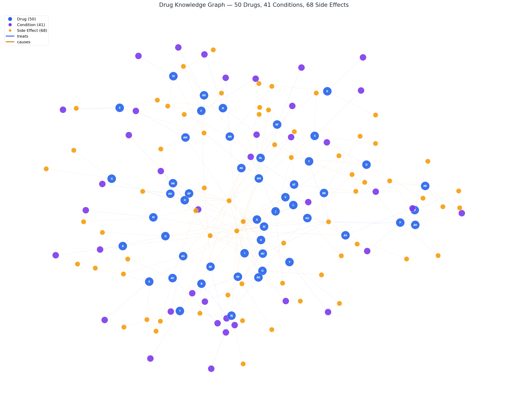

# Drug Knowledge Assistant

A hybrid RAG system that answers drug-related questions with **90% accuracy** across 50 evaluation queries — with a structured fallback that works without any LLM.

**[Try the Live Demo](https://huggingface.co/spaces/Fo-zh/drug-knowledge-assistant)** | **[Project Website](https://h-furkan.github.io/FINL/)**

---

## How It Works

```
User Question
      |
      v
 Query Classifier ──── 6 types: drug_specific, condition_lookup,
      |                 comparison, multi_hop, safety, general
      v
 3-Layer Hybrid Retrieval
 ├── Layer 1: Exact Drug Match (regex → score 1.0)
 ├── Layer 2: TF-IDF Cosine Similarity
 └── Layer 3: Condition & Side-Effect Keyword Index
      |
      v
 Sibling Document Linker ── every drug has 2 docs (usage + side effects),
      |                      always retrieves both
      v
 Score Drop-off Filter ──── cuts noise when scores drop >60%
      |
      v
 LLM Generation (or Structured Fallback)
      |
      v
    Answer
```

The system indexes **50 drugs** across **100 documents**, building a knowledge graph of **41 conditions** and **68 side effects** that powers retrieval.

---

## Key Features

- **Hybrid 3-layer retrieval** — combines exact match, TF-IDF, and keyword indexing with score fusion
- **Drug-aware sibling linking** — exploits the dataset's 2-doc-per-drug structure so multi-hop queries ("what treats asthma *and* what are its side effects?") just work
- **Query classification** — routes each question to the optimal retrieval strategy and prompt template
- **Hallucination prevention** — refuses to answer when no document scores above threshold, instead of making things up
- **Works without LLM** — structured fallback generates answers directly from `drug_knowledge.csv` (74% accuracy, zero API calls)
- **Multiple free LLM backends** — rotate between Gemma, Qwen, Nemotron, and GPT-OSS via OpenRouter
- **API key rotation** — cycles through multiple keys to handle rate limits on free tiers

---

## Knowledge Graph

The dataset is parsed into a structured graph that powers the retrieval engine:

<p align="center">
  
</p>

<p align="center">
  50 drugs (blue) · 41 conditions (purple) · 68 side effects (yellow)
</p>

---

## Evaluation Results

50 questions across 8 categories, tested end-to-end with the full pipeline:

| Category | Questions | Avg Score | Passed |
|---|---|---|---|
| Direct Fact Retrieval | 7 | **100%** | 7/7 |
| Usage-Based | 7 | **100%** | 7/7 |
| Reverse Lookup | 6 | **100%** | 6/6 |
| Complex / Combined | 7 | **100%** | 7/7 |
| Unanswerable | 5 | **100%** | 5/5 |
| Multi-Hop Reasoning | 4 | **100%** | 4/4 |
| Safety / Risk | 7 | 71% | 6/7 |
| Comparison / Multi-Drug | 7 | 61% | 5/7 |
| **Overall** | **50** | **90%** | **47/50** |

---

## Quickstart

```bash
git clone https://github.com/H-furkan/FINL.git
cd FINL
uv sync
```

Run the evaluation pipeline:

```bash
export OPENROUTER_API_KEY=your-key-here
uv run python eval_pipeline.py
```

Run tests:

```bash
uv run pytest
```

---

## Project Structure

```
.
├── app.py                     # Gradio UI (deployed to HF Spaces)
├── rag/
│   ├── data.py                # Data loading, drug index, reverse indexes
│   ├── retrieval.py           # Hybrid 3-layer retriever + query classifier
│   └── generation.py          # LLM generation + fallback + prompt templates
├── tests/
│   ├── test_data.py           # Data parsing tests
│   ├── test_retrieval.py      # Basic retrieval tests
│   ├── test_retrieval_hybrid.py  # Hybrid retriever tests
│   └── test_generation.py     # Generation pipeline tests
├── eval_pipeline.py           # 50-question evaluation suite
├── benchmark_prompts.py       # Prompt strategy comparison (3x3 grid)
├── eval_questions.md          # All 50 eval questions with expected answers
├── drug_docs.csv              # Raw dataset (100 documents)
├── drug_knowledge.csv         # Structured knowledge export (50 drugs)
├── visualize_kg.py            # Knowledge graph visualization
├── generate_web_graphs.py     # Web-optimized graph images
├── docs/                      # GitHub Pages site
│   ├── index.html
│   └── kg_*.png               # Knowledge graph images
└── memory-bank/               # AI context persistence (Cursor memory bank)
```

---

## Tech Stack

| | |
|---|---|
| **Language** | Python 3.10+ |
| **Retrieval** | scikit-learn (TF-IDF), pandas |
| **LLM** | OpenAI SDK via OpenRouter (free models) |
| **UI** | Gradio |
| **Visualization** | networkx, matplotlib |
| **Hosting** | HuggingFace Spaces (Gradio), GitHub Pages (website) |
| **Tooling** | uv, ruff, pytest |

---

## TODO / Roadmap

- [ ] **Real medicine database** — replace synthetic dataset with real drug data (e.g., FDA OpenFDA API, DrugBank)
- [ ] **Semantic embeddings** — add sentence-transformers as a 4th retrieval layer for better semantic matching
- [ ] **Drug interaction detection** — warn when queried drugs have known interactions
- [ ] **Dosage information** — extend the knowledge graph with dosing data
- [ ] **Multi-language support** — support queries in languages beyond English
- [ ] **User feedback loop** — let users rate answers to improve retrieval ranking over time
- [ ] **Caching layer** — cache frequent queries to reduce API calls and latency
- [ ] **Citation linking** — link answers back to source documents with clickable references
- [ ] **Conversation memory** — support follow-up questions with context from previous turns

---

## License

Built for the EPAM Mini Datathon.
